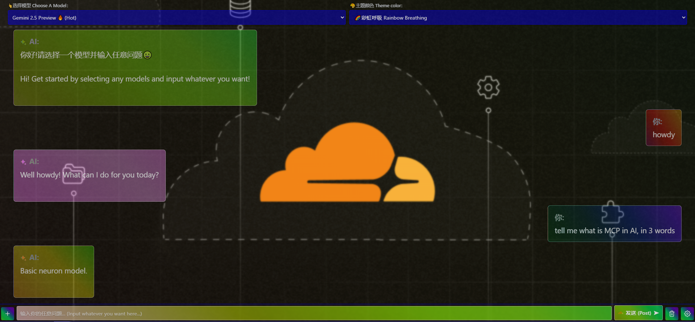
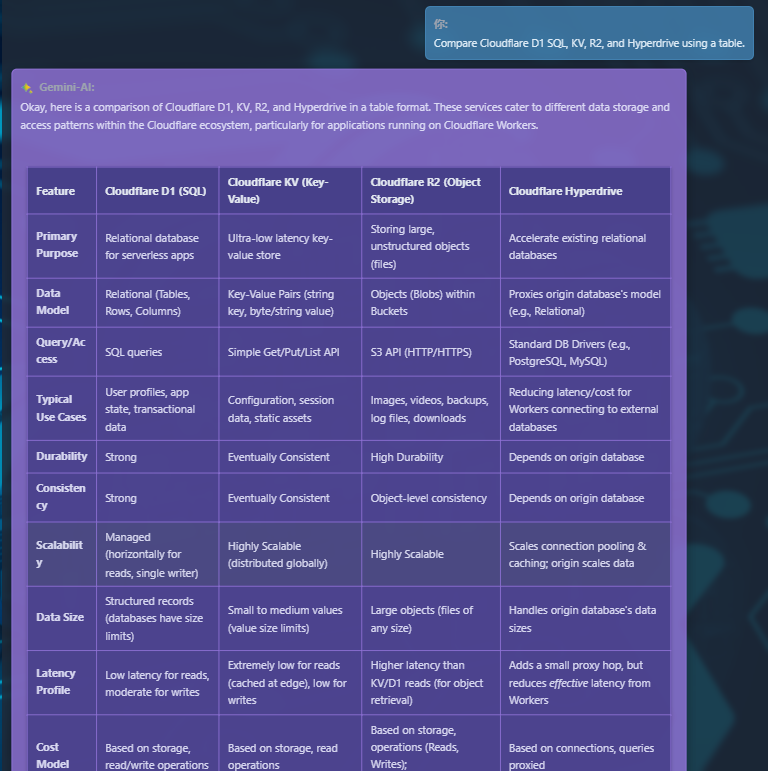
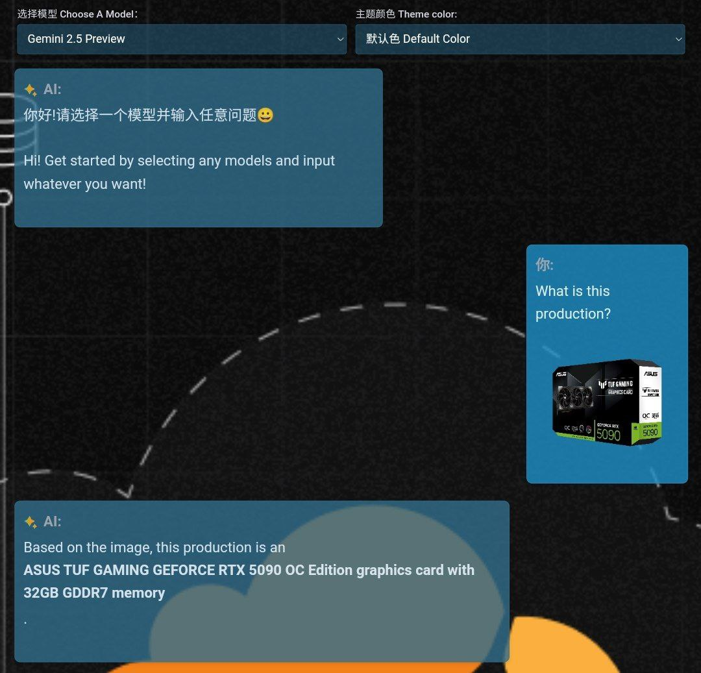
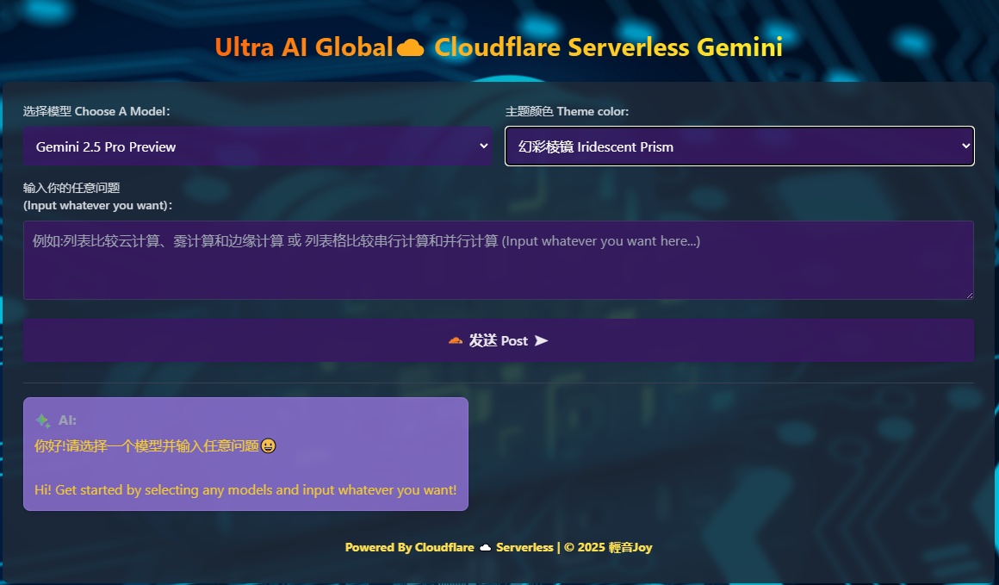
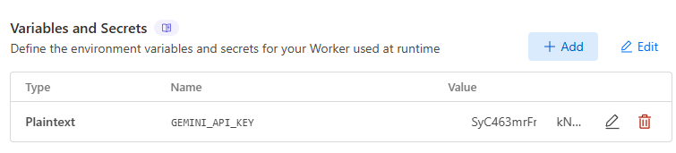

  

<h1 align="center">Ultra Cloudflare☁️Serverless AI worker</h1>

  <strong>EN:</strong> A simple yet powerful Cloudflare Worker to proxy requests to APIs. Enables access to advanced AI models from the edge, securely managing API keys and bypassing regional restrictions.Also available for others popular worker.Gonna have R2 and D2 in the later versions
   <strong>ZH:</strong> 一个简洁而强大的Cloudflare Worker，用于转发API请求至各大AI平台，并且将计算节点靠近用户部署，使得您可以从边缘访问高级AI模型，结合KV安全管理API密钥，并绕过地域限制同时支持其他主流平台worker,后期将拓展R2和D1数据库支持
   <strong>RU:</strong>Простой, но мощный Cloudflare Worker для проксирования запросов API. Обеспечивает доступ к передовым ИИ-моделям с периферии, безопасно управляя API-ключами и обходя региональные ограничения. Поддерживает интеграцию с другими Worker-платформами, в будущем планируется расширение с использованием баз данных R2 и D1.
  <b4>

  
  
  

  <em>Free, Private Gemini Access via Cloudflare. No VPN needed for restricted Countries. Full Control, with GPL 3.0 protocol</em>
   
  <em>通过Cloudflare免费、私有化访问和管理Gemini~摆脱地域限制无烦恼，完全由自己掌控，原生gemini等AI模型，支持上传图片，录音等</em>

## 🌐 Overview | 概述
 
**EN:** This Cloudflare Worker acts as a secure and efficient proxy for Google's Generative AI APIs (Gemini for text generation, Imagen for image generation). It allows you to:
*   Access Google's powerful AI models from anywhere, including regions where direct access might be challenging.
*   Securely manage your Google AI API key using Cloudflare's environment variables, keeping it out of client-side code.
*   Provide a simple, customizable HTML interface for interacting with the AI.
*   Leverage Cloudflare's global network for potentially lower latency and high scalability.
 
 Before: Your area > Not allow to access > AI ×
 Now : Your area > Cloudflare Worker > AI √
 **ZH:** 此Cloudflare Worker项目充当Google生成式AI API（Gemini用于文本生成，Imagen用于图像生成）的安全高效代理。它允许您：
*   从任何地方访问Google强大的AI模型，包括那些可能难以直接访问的地区。
*   使用Cloudflare的环境变量安全地管理您的Google AI API密钥，避免其暴露在客户端代码中。
*   提供一个简单、可定制的HTML界面与AI进行交互。
*   利用Cloudflare的全球网络实现潜在的低延迟和高可扩展性。
## 🎈 Features | 功能
 
*   **🎯 Proxy AI Requests / 转发AI请求:**
    *   EN:Or you could say it's"Forward AI request", whatever, anyway → Securely routes requests to Google's Gemini and Imagen APIs.
    *   ZH: 安全地将请求路由到Google的Gemini和Imagen API。
*   **🔑 API Key Management / API密钥管理:**
    *   EN: Store your API key securely in Cloudflare Worker environment variables.
    *   ZH: 将您的API密钥安全地存储在Cloudflare Worker环境变量中。
*   **📄 Simple HTML Interface / 简单的HTML界面:**
    *   EN: Includes a user-friendly HTML front-end with theme selection for easy interaction.
    *   ZH: 包含一个用户友好的HTML前端，并提供主题选择，方便交互。
*   **🔄 CORS Handling / CORS处理:**
    *   EN: Pre-configured to handle Cross-Origin Resource Sharing.
    *   ZH: 已预先配置处理跨域资源共享（CORS）。
*   **💨 Supports Streaming / 支持流式传输:**
    *   EN: Handles streaming text responses from models like Gemini for real-time output.
    *   ZH: 支持从Gemini等模型获取流式文本响应，实现实时输出。
*   **🖼️ Supports Image Generation / 支持图像生成:**
    *   EN: Handles image generation requests and displays results from Imagen.
    *   ZH: 支持处理图像生成请求并显示来自Imagen的结果。
*   **🌍 No VPN Proxy Required / 访问无需翻牆挂代理:**
    *   EN: For users in regions with restricted access, this proxy on Cloudflare's network can enable access without a VPN for the end-user.
    *   ZH: 对于某些地区可能无法直接访问Google API的用户，在Cloudflare的网络上部署此代理可以让最终用户无需翻墙即可访问。
 
## 👍 Advantages of using Cloudflare Workers | 使用Cloudflare Worker的优点

**EN:**
*   **💸 Serverless & Cost-Effective:** No server management needed. The free tier is often generous enough for personal projects.
*   **⚡ Edge Deployment:** Runs closer to your users, reducing latency.
*   **📈 Scalability:** Automatically scales with traffic.
*   **🚀 Ease of Deployment:** Deploy directly from the Cloudflare dashboard or via Wrangler CLI.
*   **🔒 Secure API Key Handling:** Keep your API keys safe using encrypted environment variables.
 
**ZH:**
*   **💸 无服务器且经济高效：** 无需管理服务器。免费套餐通常足以满足个人项目需求。
*   **⚡ 边缘部署：** 更接近用户运行，减少延迟。支持多种平台worker
*   **📈 可扩展性：** 随流量自动扩展。
*   **🚀 易于部署：** 可直接通过Cloudflare等平台控制台或Wrangler CLI部署。
*   **🔒 安全的API密钥处理：** 使用加密的环境变量安全保管您的API密钥。
## 🚀 Setup & Deployment | 设置与部署 
Follow these steps to deploy your own instance:
请按照以下步骤部署您自己的实例：

1.  **Create a Cloudflare Worker | 创建Cloudflare Worker:**
    *   EN: Log in to your Cloudflare dashboard, navigate to "Workers & Pages", and click "Create application", then "Create Worker". Give it a name (e.g., `ultra-ai-proxy`).
    *   ZH: 登录到您的Cloudflare控制台，导航到“Workers & Pages”，点击“创建应用程序”，然后选择“创建Worker”。为其命名（例如 `ultra-ai-proxy`）。

2.  **Configure the Worker | 配置Worker:**
    *   EN: Click "Configure Worker" or "Quick edit" for your newly created worker.
    *   ZH: 点击新创建Worker的“配置Worker”或“快速编辑”。

3.  **Paste the Code Files | 粘贴代码文件:**
    *   EN: The project is modular. You'll need to create/replace the following files in the Cloudflare online editor with the provided code:
        *   `worker.js` (or `index.js` if that's your main file name in the editor)
        *   `request-handler.js`
        *   `api-handler.js`
        *   `html-renderer.js`
        *   `utils.js`
    *   ZH: 本项目是模块化的。您需要在Cloudflare在线编辑器中创建/替换以下文件，并使用本项目提供的代码：
        *   `worker.js` (如果在编辑器中您的主文件名是 `index.js`，则使用该名称)
        *   `request-handler.js`
        *   `api-handler.js`
        *   `html-renderer.js`
        *   `utils.js`
    *   *(You can find the code for these files in this repository or from where you received them.)*

4.  **Add Environment Variable for API Key | 添加API密钥环境变量:**
    *   EN: Go to your Worker's **Settings** tab, then **Variables**.
    *   Under **Environment Variables**, click **"Add variable"**.
        *   **Variable name:** `GEMINI_API_KEY`
        *   **Value:** Your actual Google AI Studio or Google Cloud Vertex AI API Key.
        *   **IMPORTANT:** Click the **"Encrypt"** button next to the value field to secure your API key.
 
    *   ZH: 进入Worker的 **设置 (Settings)** 选项卡, 然后选择 **变量 (Variables)**。
    *   在 **环境变量 (Environment Variables)** 部分, 点击 **"添加变量 (Add variable)"**。
        *   **变量名称 (Variable name):** `GEMINI_API_KEY`
        *   **值 (Value):** 您真实的 Google AI Studio 或 Google Cloud Vertex AI API 密钥。
        *   **重要：** 点击值字段旁边的 **"加密 (Encrypt)"** 按钮以保护您的API密钥。

5.  **Save and Deploy | 保存并部署:**
    *   EN: After adding the code and the environment variable, click the **"Save and Deploy"** button in the editor or on the Worker's settings page.
    *   ZH: 添加代码和环境变量后，在编辑器或Worker的设置页面点击 **"保存并部署 (Save and Deploy)"** 按钮。

Your AI proxy should now be live at the URL provided by Cloudflare (e.g., `your-worker-name.your-subdomain.workers.dev`).

您的AI代理现在应该已在Cloudflare提供的URL上激活（例如 `your-worker-name.your-subdomain.workers.dev`）。

## 🛠️ Usage | 使用方法

*   **EN:** Simply navigate to your Worker's URL in a web browser. You'll see the HTML interface.
    *   Select a model from the dropdown.
    *   Choose a theme.
    *   Type your prompt or image description into the textarea.
    *   Click "发送 Post".
*   **ZH:** 在网页浏览器中直接访问您的Worker URL。您将看到HTML界面。
    *   从下拉菜单中选择一个模型。
    *   选择一个主题。
    *   在文本区域输入您的问题或画面描述。
    *   点击“发送 Post”按钮。

### Customization | 自定义
*   **HTML & CSS:** Modify `html-renderer.js` to change the look and feel of the front-end.
*   **Models:** Update the `allowedModels` array in `api-handler.js` if new Gemini/Imagen models are released or if you want to restrict options.
*   **Themes:** Add or modify themes in the `themeConfig` object within the client-side script in `html-renderer.js`.
### 🔄 贡献指南/Contributer
请基于 `discover` 分支开发您的功能并提交 Pull Request。会定期从 `discover` 中精选高质量的更改合并进 `main`。
或联系开发者邮箱:dev@qyjoy.vip

### ⚠️ 澄清：“API 转发 / API 代理” ≠ “网络代理”Clarification: “API Forwarding / API Proxy” ≠ “Network Proxy”
**ZH**
有些用户担心本项目因“代理”字样是否违反 Cloudflare 服务条款，这里做一个清晰的技术澄清：
本项目属于**API 转发 / API 代理（API forwarder / proxy）**，**不是网络代理（Network Proxy）**。
- ✅ 它仅转发请求到**特定的公开 API（如 Google 的 Gemini 和 Imagen）**
- ❌ 它不支持访问任意网站
- ❌ 它不提供 VPN、SOCKS5、Shadowsocks、Trojan 等网络代理协议或服务
Cloudflare 所禁止的“网络代理”，指的是通用数据转发或翻墙用途的工具。而本项目只是通过 Cloudflare Worker 将 Web 前端请求安全透明地转发给合法 API 服务，功能专一、无滥用空间。
因此，本项目**完全符合 Cloudflare 使用政策**，是 Cloudflare Worker 的标准合规用例。
---
### 📊 API 转发 vs. 网络代理 对比表
| 特性 / Feature                             | API Forward (API Proxy)                         | Network Proxy (VPN/SOCKS/Shadowsocks 等)      |
|-------------------------------------------|------------------------------------------------|----------------------------------------------|
| 🔌 访问范围                                | 指定 API 服务（如 Gemini、Imagen 等）          | 任意网站、应用程序、通用网络流量              |
| 🔍 ISO Layer                              | 基于7层的应用转发                               | 基于4层的网络包代理  |
| 📦 数据内容                                | 请求和响应均为结构化 API 数据（如 JSON）         | 原始 IP 包或加密流量（如 TCP、UDP）            |
| 🧠 用途                                     | 前端→Worker→API 安全转发，用于接口调用          | 匿名访问、翻墙、绕过网络限制                   |
| 🔐 安全性                                   | 精确控制目标 API，不可滥用                      | 可被用于非法流量、IP 池攻击、绕过审查等        |
| 🛠️ 底层协议                                | HTTPS 请求转发                                  | TCP/IP 层或自定义加密隧道协议（如 VPN）        |
| ☁️ Cloudflare 是否允许使用                 | ✅ 是，属于 Cloudflare Worker 正常用途           | ❌ 否，违反 Acceptable Use Policy              |
| ⚙️ 部署复杂度                               | 低：纯 Worker 脚本 + API 配置                   | 高：需要服务端、端口映射、防火墙规则等         |
| 🎯 示例项目                                 | Cloudflare Worker 转发 Gemini API              | Clash、Trojan、V2Ray、Shadowsocks 等工具       |
> ✅ 本项目使用的是 **API Forward** 模式，完全符合 Cloudflare 的服务政策，安全、可控、稳定。

**EN:**
Some users have asked whether this project violates Cloudflare's Terms of Service because of the term "proxy" being used. Let's clarify:
This project is an **API forwarder / API proxy**, not a **network proxy**.
- ✅ It only relays requests to **specific public APIs** (e.g., Google Gemini, Imagen, etc.)
- ❌ It does **not** allow general access to arbitrary websites
- ❌ It does **not** provide tunnels, SOCKS5, Shadowsocks, or VPN-like services
In Cloudflare’s terms, a **network proxy** refers to tools that allow general traffic routing and circumvention of regional restrictions. This project does none of that.
Therefore, this project **fully complies** with Cloudflare’s Acceptable Use Policy and is a **legitimate use of Cloudflare Workers** to route frontend API requests through serverless infrastructure.
> 🔒 This is safe, legal, and compliant. 安全合规，放心部署。
## 📝 License | 许可证

**EN:** This project is free software: you can redistribute it and/or modify it under the terms of the **GNU General Public License as published by the Free Software Foundation, either version 3 of the License, or (at your option) any later version.**

This program is distributed in the hope that it will be useful, but WITHOUT ANY WARRANTY; without even the implied warranty of MERCHANTABILITY or FITNESS FOR A PARTICULAR PURPOSE. See the GNU General Public License for more details.

You should have received a copy of the GNU General Public License along with this program. If not, see <https://www.gnu.org/licenses/>.

**ZH:** 本项目是自由软件：您可以根据 **自由软件基金会发布的GNU通用公共许可证的条款重新分发和/或修改它，无论是许可证的第3版，还是（根据您的选择）任何更高版本。**

分发本程序是希望它能有用，但没有任何担保；甚至没有对适销性或特定用途适用性的暗示担保。更多详情请参阅GNU通用公共许可证。

您应该已经随本程序收到一份GNU通用公共许可证的副本。如果没有，请参阅 <https://www.gnu.org/licenses/>。

You can find the full license text in the [LICENSE](LICENSE) file.
您可以在 [LICENSE](LICENSE) 文件中找到完整的许可证文本。

---

  Made with ❤️ by 輕音Joy with Gemini Optimization	
   
  <em>If you find this useful, please consider giving a ⭐!</em>

